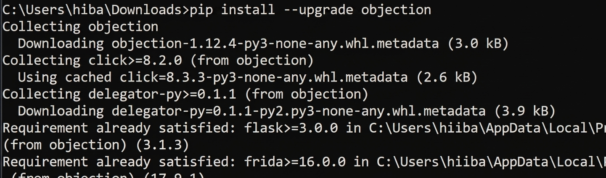
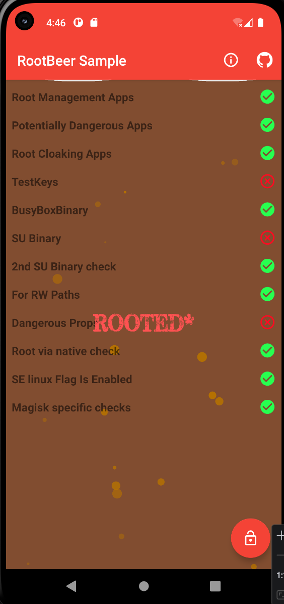
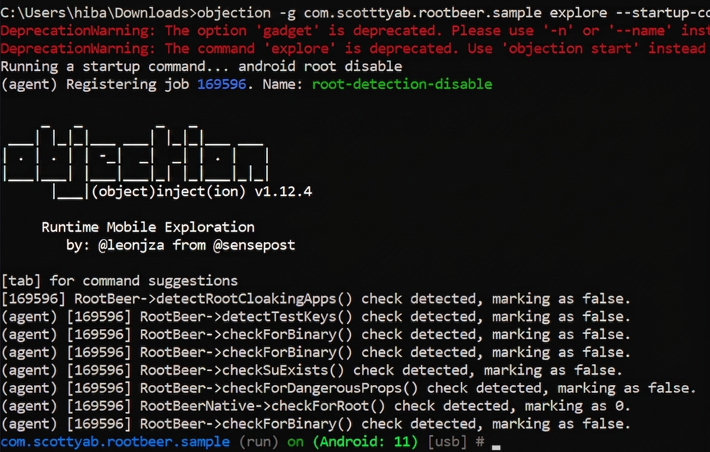
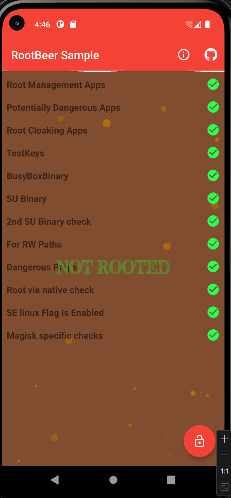
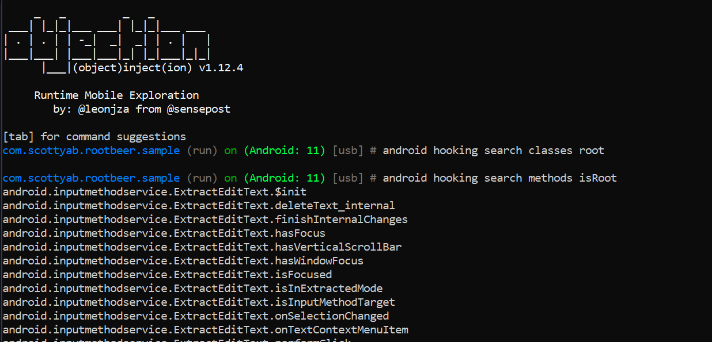
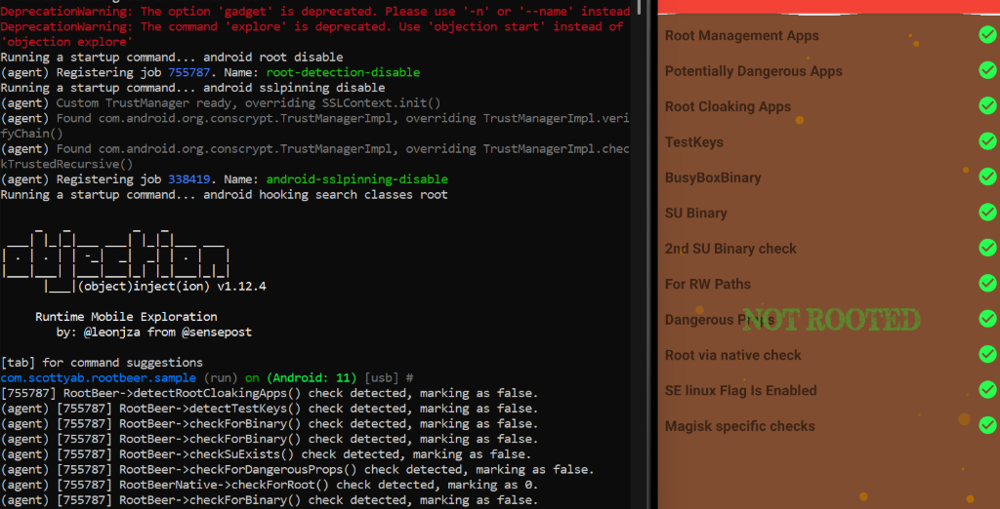
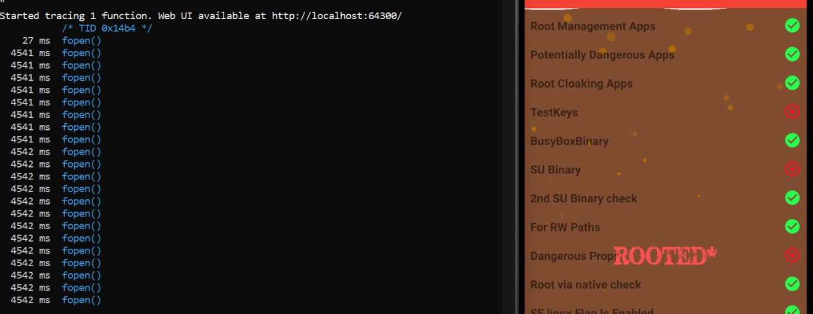

# Bypass de Root Detection avec Objection et Frida

Ce rapport détaille la réalisation du laboratoire sur le contournement des mécanismes de détection de root dans une application Android en utilisant les outils **Objection** et **Frida**.

---

## 1. Installation d'Objection

La première étape a consisté à installer l'outil **Objection** via le gestionnaire de paquets Python `pip`. Objection est une boîte à outils d'exploration mobile alimentée par Frida, qui permet d'effectuer des tâches d'instrumentation complexes sans avoir à écrire de scripts Frida personnalisés.

*Figure 1 : Installation et mise à jour d'Objection via pip.*

---

## 2. État Initial de l'Application (Avant Bypass)

Avant d'appliquer l'instrumentation, nous avons testé l'application cible (**RootBeer Sample**). Comme le montre la capture ci-dessous, l'application détecte que l'appareil est rooté, affichant le message **"ROOTED"** et marquant plusieurs vérifications (comme TestKeys et SU Binary) en rouge.

*Figure 2 : L'application détecte la présence du root.*

---

## 3. Instrumentation et Bypass Root avec Objection

Pour contourner cette détection, nous avons utilisé Objection avec la commande `android root disable`. Cette commande injecte automatiquement des hooks dans les classes Java couramment utilisées pour la détection de root (comme la vérification de fichiers système, de propriétés système, etc.).

Nous avons lancé l'application avec la commande de démarrage intégrée :
`objection -g com.scottyab.rootbeer.sample explore --startup-command "android root disable"`

*Figure 3 : Injection des hooks de bypass root au démarrage de l'application.*

---

## 4. Validation du Bypass

Une fois les hooks installés, l'application a été relancée sous instrumentation. Le résultat est immédiat : l'application affiche désormais **"NOT ROOTED"**, confirmant que les mécanismes de détection ont été neutralisés avec succès.

*Figure 4 : Application affichant "NOT ROOTED" après l'application des hooks.*

Nous avons également exploré les classes et méthodes liées au root directement depuis la console Objection :

*Figure 5 : Recherche de classes et méthodes liées au root via la console Objection.*

---

## 5. Automatisation avec Multiples Commandes

Il est possible d'enchaîner plusieurs commandes au démarrage pour désactiver simultanément le root et d'autres protections comme le SSL Pinning.

*Figure 6 : Utilisation de plusieurs startup-commands pour une instrumentation complète.*

---

## 6. Analyse des Checks Natifs (Bonus)

Certaines applications utilisent des appels système natifs (C/C++) pour détecter le root. Pour identifier ces appels, nous avons utilisé `frida-trace` afin de surveiller les appels à la fonction `fopen` dans la bibliothèque système `libc.so`. Cela permet de voir quels fichiers sensibles l'application tente d'ouvrir pour vérifier l'état du root.

*Figure 7 : Traçage des appels système natifs (fopen) pour identifier les vérifications de fichiers.*

---

## Conclusion

Ce laboratoire a démontré l'efficacité d'**Objection** pour automatiser le bypass de détections complexes sur Android. En combinant l'instrumentation Java et le traçage natif avec Frida, nous avons pu neutraliser totalement les sécurités de l'application RootBeer Sample.
